# Markdown Challenges

## Hi there 👋
- 🔭 I’m currently working on something cool!
- 🌱 I’m currently learning with help from docs.github.com
- 💬 Ask me about Github

## Skills

1. Frontend development

2. Backend development

3. Framework

## Top skills

## Github Stats

## Bye

